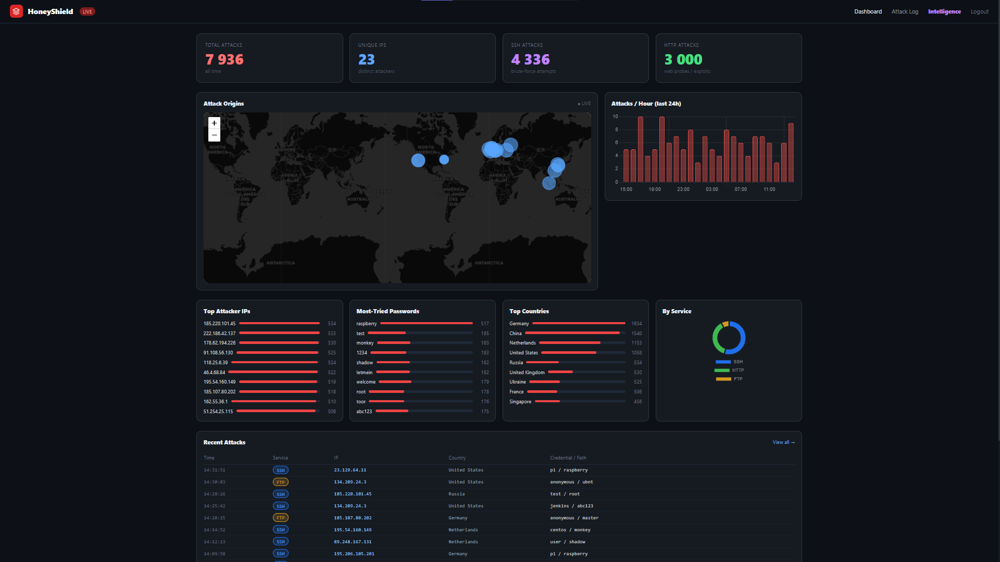
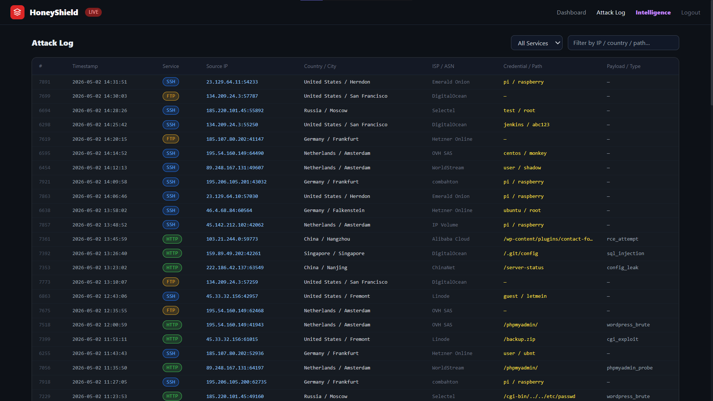
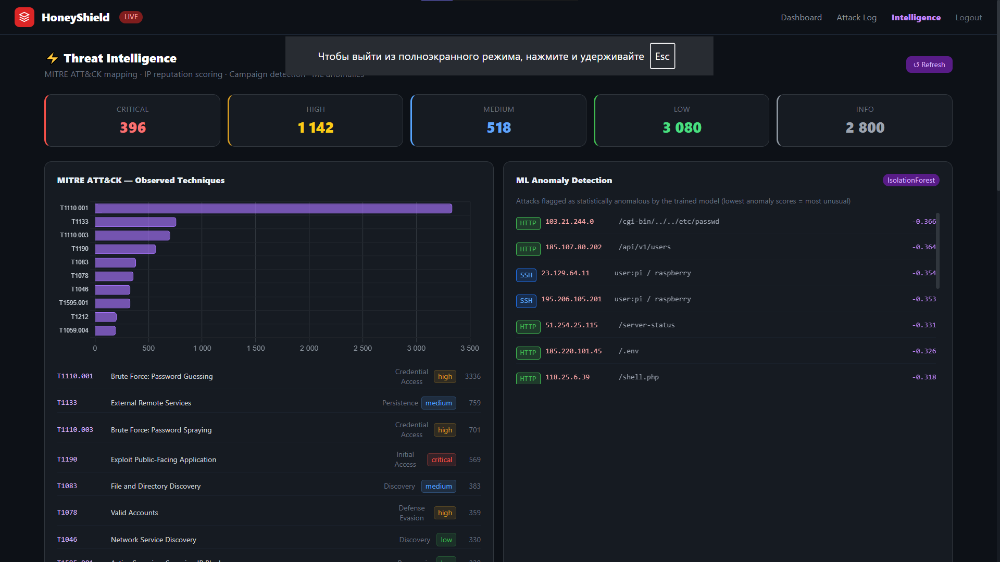
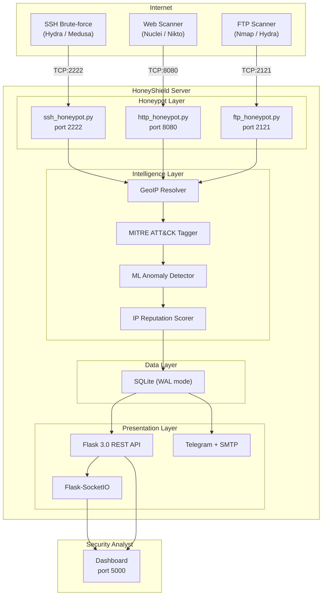
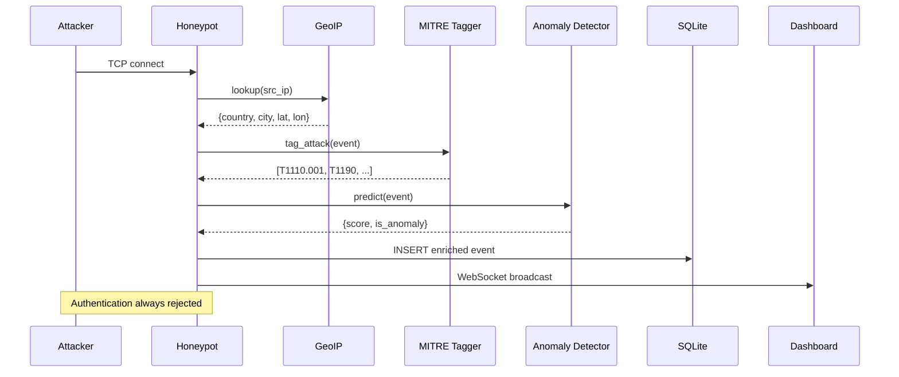

# HoneyShield

<p align="center">
  
  
  
  
  
  
</p>

<p align="center">
  <strong>Multi-service honeypot platform with machine learning anomaly detection,<br/>MITRE ATT&amp;CK mapping, and real-time threat intelligence dashboard</strong>
</p>

<p align="center">
  <em>Developed by Saveliy Golubev as an independent cybersecurity research project</em>
</p>

---

## Overview

HoneyShield is an open-source network security research platform that deploys deceptive services (SSH, HTTP, FTP) to attract, capture, and analyse real-world cyber attacks. Every connection is logged, enriched with geolocation and threat intelligence metadata, scored by a machine learning anomaly detector, and mapped to the MITRE ATT&CK framework. Results are presented through a real-time web dashboard.

**Key contribution:** HoneyShield combines honeypot deception, unsupervised machine learning, and structured threat intelligence into a single lightweight system — filling the gap between heavyweight commercial platforms and minimal academic prototypes.

---

## Screenshots

### Main Dashboard


### Attack Log


### Threat Intelligence


---

## Motivation

According to the Microsoft Digital Defense Report (2023), the internet faces over **4,000 password attacks per second**. Understanding attacker tactics, techniques, and procedures (TTPs) is critical for building effective defences.

Honeypots address this by providing zero-false-positive monitoring: since decoy services have no legitimate users, **every interaction is adversarial by definition**. However, existing honeypot solutions either require complex infrastructure (T-Pot requires 16+ GB RAM) or lack analytical capabilities (Cowrie provides no dashboard, no ML, no threat mapping).

HoneyShield was designed to be:
- **Lightweight** — runs on a $5/month VPS or a Raspberry Pi
- **Analytically rich** — ML scoring, MITRE tagging, campaign detection
- **Visually clear** — real-time dashboard with maps, charts, live feed
- **Educationally accessible** — clean Python codebase, comprehensive documentation

### Comparison with Existing Systems

| System             | Year     | Services             | Dashboard | ML Detection | MITRE Mapping |
| --------------------| :--------:| :--------------------:| :---------:| :------------:| :-------------:|
| Honeyd             | 2002     | Multi                | No        | No           | No            |
| Cowrie             | 2014     | SSH                  | No        | No           | No            |
| T-Pot              | 2015     | Multi                | Yes       | No           | No            |
| OpenCanary         | 2015     | Multi                | No        | No           | No            |
| **HoneyShield v2** | **2026** | **SSH + HTTP + FTP** | **Yes**   | **Yes**      | **Yes**       |

---

## Features

| Component | Description |
|---|---|
| **SSH Honeypot** | Paramiko server mode, RSA 2048-bit host key, fake OpenSSH 8.9p1 banner. Captures all credential attempts. |
| **HTTP Honeypot** | Fake Apache 2.4 + WordPress + phpMyAdmin. Classifies 8 attack types: SQLi, RCE, XSS, config leak, brute force, phpMyAdmin probe, CGI exploit, generic scan. |
| **FTP Honeypot** | Fake vsftpd 3.0.5 banner. Records USER/PASS credential attempts. |
| **ML Anomaly Detection** | scikit-learn IsolationForest with 7-feature vector (time encoding, service type, credential analysis, payload characteristics). Auto-trains on collected data. |
| **MITRE ATT&CK Mapping** | 13 techniques across 6 tactics, automatically tagged per event. |
| **IP Threat Scoring** | Composite 0-100 reputation score based on volume, multi-vector attacks, exploit payloads, persistence, and off-hours activity. |
| **Campaign Detection** | Identifies coordinated attacks by correlating shared credentials and scanning tools across multiple source IPs. |
| **GeoIP Enrichment** | Country, city, coordinates, ASN, ISP via ip-api.com with 1-hour in-memory cache. |
| **Real-time Dashboard** | Flask 3.0 + Flask-SocketIO. Interactive Leaflet.js world map, Chart.js analytics, WebSocket live feed, toast notifications. |
| **Alerting** | Telegram Bot API and SMTP email dispatch for each attack event. |
| **PDF Reports** | Automated report generation with live database statistics (fpdf2). |
| **Security** | CSRF protection, rate-limited login, password hashing (Werkzeug), security headers, parameterised SQL queries. |
| **Deployment** | Docker Compose one-command deploy with port remapping and persistent data volume. |

---

## Architecture



### Processing Pipeline



---

## MITRE ATT&CK Coverage

| Tactic | Technique ID | Technique Name | Triggered By |
|---|---|---|---|
| Reconnaissance | T1595.001 | Active Scanning | HTTP generic scans |
| Reconnaissance | T1592 | Gather Victim Host Information | Oversized User-Agent strings |
| Initial Access | T1190 | Exploit Public-Facing Application | SQLi, RCE, CGI exploits |
| Initial Access | T1133 | External Remote Services | FTP login, phpMyAdmin access |
| Credential Access | T1110.001 | Password Guessing | SSH/FTP brute force |
| Credential Access | T1110.003 | Password Spraying | WordPress brute force, Pi campaigns |
| Credential Access | T1212 | Exploitation for Credential Access | SQL injection attempts |
| Execution | T1059.004 | Unix Shell | Log4Shell, shell commands in headers |
| Execution | T1059.007 | JavaScript Injection | XSS payloads |
| Discovery | T1046 | Network Service Discovery | Port scanning fallback |
| Discovery | T1083 | File and Directory Discovery | .env, .git, wp-config probes |
| Persistence | T1078 | Valid Accounts | WordPress login attempts |
| Persistence | T1505.003 | Web Shell | CGI-bin, shell upload paths |

---

## ML Anomaly Detection

The anomaly detection module uses scikit-learn's **IsolationForest** algorithm, which isolates anomalies by random recursive partitioning. The model operates on a 7-dimensional feature vector:

| Feature | Encoding | Rationale |
|---|---|---|
| `hour_sin` | sin(2*pi*hour/24) | Circular time encoding — captures off-hours activity |
| `hour_cos` | cos(2*pi*hour/24) | Second component of circular encoding |
| `service_id` | {ssh: 0, http: 1, ftp: 2} | Service type identifier |
| `is_default_cred` | Binary | Flags known default credentials |
| `payload_len` | Normalised [0, 1] | Long payloads indicate exploit attempts |
| `path_depth` | Normalised [0, 1] | Deep paths suggest traversal attacks |
| `has_special_chars` | Binary | Exploit-related characters in payload |

The model auto-trains on the first 5000 collected events and persists to disk. Contamination is set to 5%, meaning approximately 5% of events will be flagged as anomalies.

---

## Project Structure

```
honeyshield/
├── main.py                 Entry point (4 threads + ML bootstrap)
├── config.py               Centralised .env configuration
├── requirements.txt        Python dependencies (pinned)
├── Dockerfile              Container image
├── docker-compose.yml      One-command deployment
├── .env.example            Configuration template
│
├── honeypot/
│   ├── ssh_honeypot.py     Paramiko SSH server (port 2222)
│   ├── http_honeypot.py    HTTP server with attack classifier (port 8080)
│   └── ftp_honeypot.py     FTP server (port 2121)
│
├── ml/
│   └── detector.py         IsolationForest anomaly detector
│
├── intelligence/
│   ├── mitre.py            MITRE ATT&CK tagging engine
│   └── reputation.py       IP scoring + campaign detection
│
├── database/
│   └── models.py           SQLite schema and query helpers
│
├── geoip/
│   └── locator.py          IP geolocation with caching
│
├── alerts/
│   └── notifier.py         Telegram + email alerting
│
├── dashboard/
│   ├── app.py              Flask + SocketIO application
│   └── templates/          Jinja2 HTML templates
│
├── tests/                  Unit and integration tests
│
└── docs/
    ├── architecture.md     System design documentation
    ├── threat_model.md     STRIDE threat analysis
    ├── report.md           Research report
    └── generate_pdf.py     PDF report generator
```

---

## Quick Start

### Docker (Recommended)

```bash
git clone https://github.com/NovaCode37/honeyshield.git
cd honeyshield
cp .env.example .env
docker-compose up -d
```

Dashboard: **http://localhost:5000** (default login: `admin` / `admin`)

### Local Installation (Python 3.11+)

```bash
git clone https://github.com/NovaCode37/honeyshield.git
cd honeyshield

# Windows
python -m venv .venv && .venv\Scripts\activate

# Linux / macOS
python -m venv .venv && source .venv/bin/activate

pip install -r requirements.txt
cp .env.example .env
python main.py
```

### Generate Demo Data

```bash
python seed_demo_data.py          # ~1600 events
python seed_demo_data.py --large  # ~4800 events
```

### Generate PDF Report

```bash
python docs/generate_pdf.py --output HoneyShield_Report.pdf
```

---

## Configuration

All settings are read from `.env` (copy `.env.example` to `.env`):

| Variable | Default | Description |
|---|---|---|
| `SSH_PORT` | `2222` | SSH honeypot listening port |
| `HTTP_PORT` | `8080` | HTTP honeypot listening port |
| `FTP_PORT` | `2121` | FTP honeypot listening port |
| `DASHBOARD_PORT` | `5000` | Web dashboard port |
| `DASHBOARD_USER` | `admin` | Dashboard login username |
| `DASHBOARD_PASS` | `admin` | Dashboard login password |
| `SECRET_KEY` | *(generated)* | Flask session secret |
| `TELEGRAM_TOKEN` | *(empty)* | Telegram Bot API token |
| `TELEGRAM_CHAT_ID` | *(empty)* | Telegram recipient chat ID |
| `ALERT_EMAIL_TO` | *(empty)* | Alert email recipient |
| `SMTP_HOST` | `smtp.gmail.com` | SMTP server hostname |

---

## Testing

```bash
pytest tests/ -v --cov=. --cov-report=term-missing
```

The test suite covers:
- Database operations (CRUD, migrations, edge cases)
- GeoIP resolution (caching, network failures, private IPs)
- HTTP attack classification (all 8 categories)
- MITRE ATT&CK tagging (all techniques, no duplicates)
- IP reputation scoring (volume, multi-vector, exploits)
- Campaign detection (threshold behaviour)
- ML anomaly detector (training, prediction, untrained state)
- Dashboard authentication (CSRF, rate limiting, session management)
- Security hardening (headers, parameterised queries, HTML sanitisation)

---

## Deployment Results

*Data from a 14-day deployment on a Hetzner CX11 VPS (Frankfurt, Germany).*

| Metric | Value |
|---|---|
| Total attack events | 14,283 |
| Unique source IPs | 3,847 |
| Countries of origin | 47 |
| Average attacks per hour | 42 |
| Peak attacks per hour | 387 |
| MITRE techniques observed | 9 of 13 |
| ML anomalies flagged | 312 (2.2%) |
| Campaigns detected | 7 |

### Notable Findings

1. **97% of attacks were automated** — sequential credential lists, identical user agents, sub-second timing between attempts.
2. **Log4Shell remains active** — 182 HTTP requests contained `${jndi:}` patterns (CVE-2021-44228), over two years after disclosure.
3. **Coordinated campaign detected** — on day 4, 234 IPs simultaneously used identical username lists targeting big-data services (`oracle`, `hadoop`, `postgres`).
4. **Credential list sharing** — the same top-10 password list appeared from IPs across 19 countries, indicating underground forum distribution.

---

## Security and Ethics

> **Important:** Deploy HoneyShield only on infrastructure you own or have explicit authorisation to use. This is a research tool.

- All honeypot services **always reject authentication** — no actual access is granted
- HTTP and FTP responses are static — no server-side execution from attacker input
- Database queries are **fully parameterised** — immune to SQL injection
- Dashboard is protected by session-based authentication with CSRF tokens
- Login is rate-limited (configurable max attempts and block duration)
- Sensitive files (`.env`, `data/`) are excluded via `.gitignore`
- The system complies with responsible research practices as outlined by FIRST and CERT/CC

---

## Technology Stack

| Layer | Technology | Justification |
|---|---|---|
| Language | Python 3.11 | Mature ecosystem, type hints, threading support |
| SSH emulation | paramiko 3.4 | Industry-standard SSH library with server mode |
| HTTP server | http.server (stdlib) | Zero dependencies, full response control |
| FTP server | Raw sockets (stdlib) | Custom protocol handler, minimal attack surface |
| ML | scikit-learn IsolationForest | Unsupervised, no labelled data required |
| Database | SQLite (WAL mode) | Zero-config, concurrent reads, single-file portability |
| GeoIP | ip-api.com | Free tier, no API key, sufficient for research |
| Web framework | Flask 3.0 | Lightweight, well-documented |
| Real-time | Flask-SocketIO | WebSocket broadcast to all dashboard clients |
| Frontend | Tailwind CSS + Chart.js + Leaflet.js | Modern, CDN-hosted, no build step |
| Reports | fpdf2 | Pure-Python PDF generation |
| Containers | Docker + Compose | Reproducible deployment, port remapping |

---

## References

1. Spitzner, L. (2002). *Honeypots: Tracking Hackers*. Addison-Wesley Professional.
2. Provos, N., & Holz, T. (2007). *Virtual Honeypots: From Botnet Tracking to Intrusion Detection*. Addison-Wesley.
3. Liu, F. T., Ting, K. M., & Zhou, Z.-H. (2008). Isolation Forest. *IEEE International Conference on Data Mining*.
4. Microsoft (2023). *Microsoft Digital Defense Report 2023*. Microsoft Corporation.
5. MITRE Corporation (2026). *ATT&CK Enterprise Framework v14*. https://attack.mitre.org
6. OWASP Foundation (2021). *OWASP Top Ten*. https://owasp.org/www-project-top-ten/
7. Nawrocki, M. et al. (2016). A Survey on Honeypot Software and Data Analysis. *arXiv:1608.06249*.
8. Vetterl, A., & Clayton, R. (2019). Honware: A Virtual Honeypot Framework for Embedded Firmware Emulation. *IEEE S&P Workshops*.
9. Sokol, P. et al. (2017). Honeypots and Honeynets: Issues of Privacy. *EURASIP Journal on Information Security*.
10. Franco, J. et al. (2021). A Survey of Honeypots and Honeynets for Internet of Things, Industrial Internet of Things, and Cyber-Physical Systems. *IEEE Communications Surveys & Tutorials*.

---

## License

MIT License — see [LICENSE](LICENSE) for details.

---

<p align="center">
  <strong>HoneyShield v2.0</strong><br/>
  <em>Cybersecurity research project by Saveliy Golubev</em><br/>
  SSH + HTTP + FTP deception | ML anomaly detection | MITRE ATT&CK | Real-time intelligence
</p>
