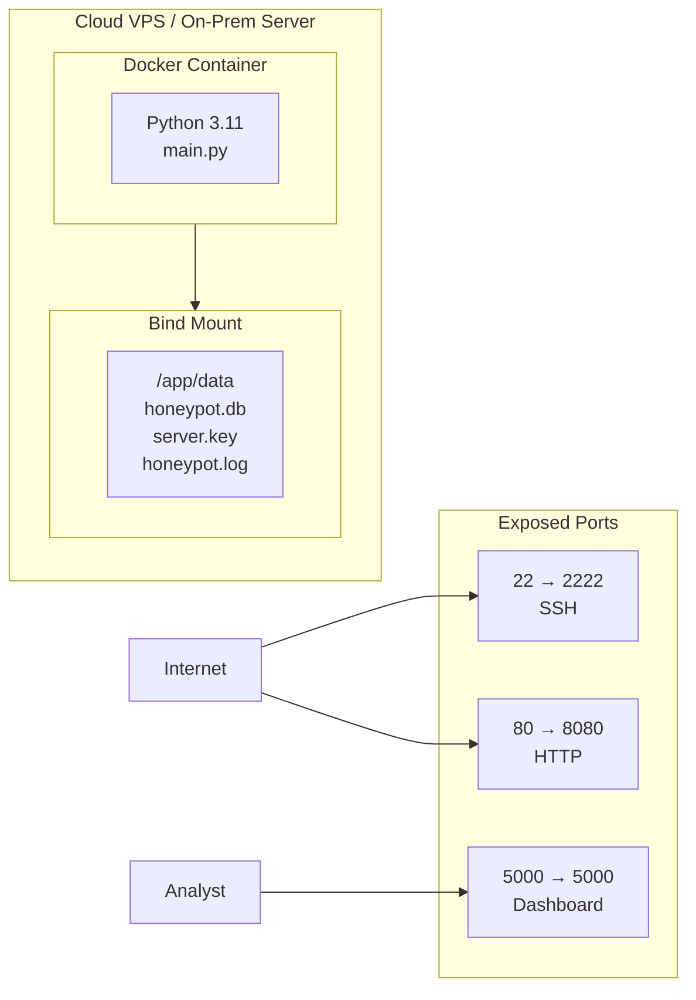
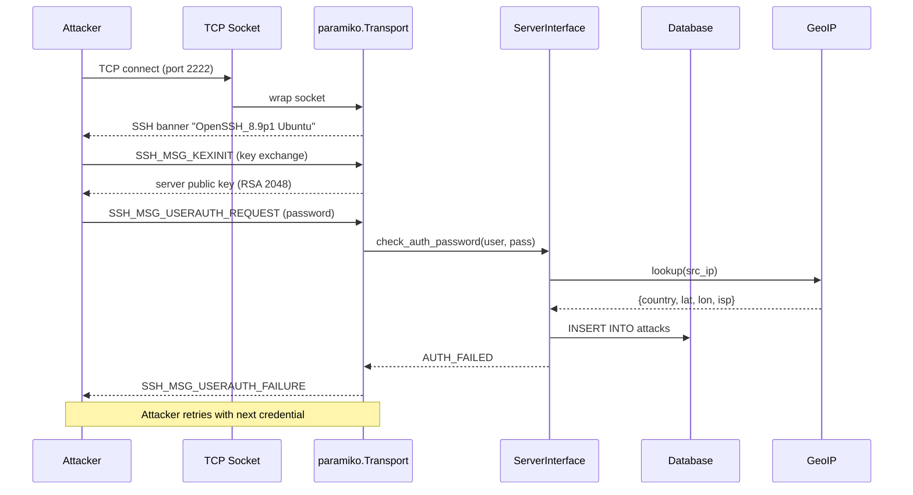
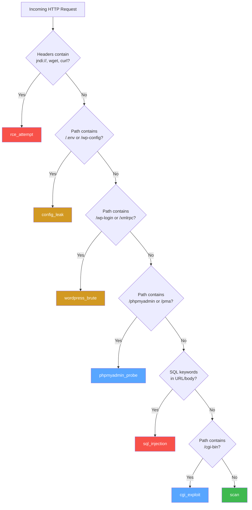
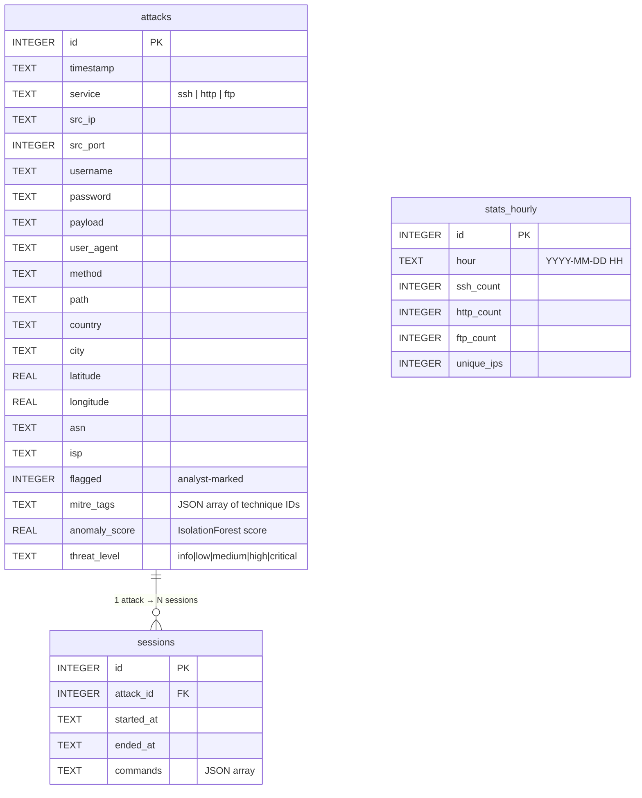
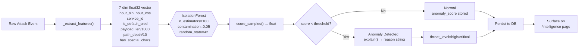
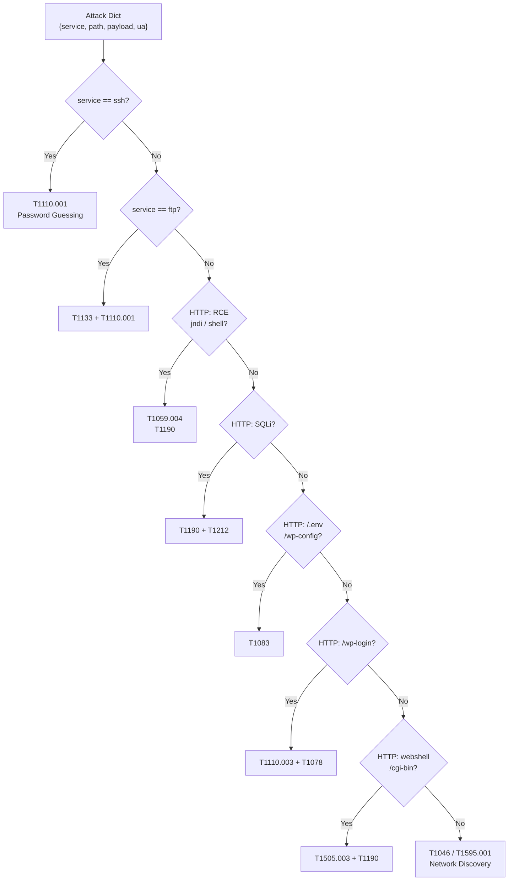
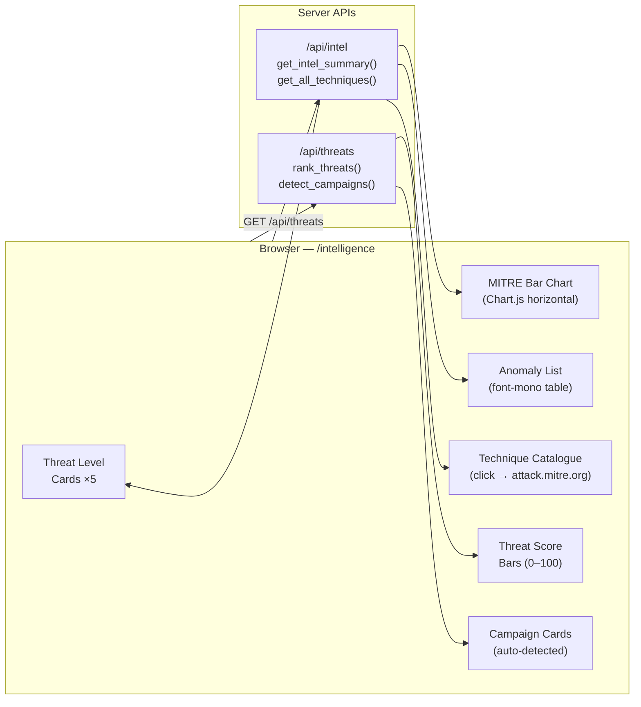
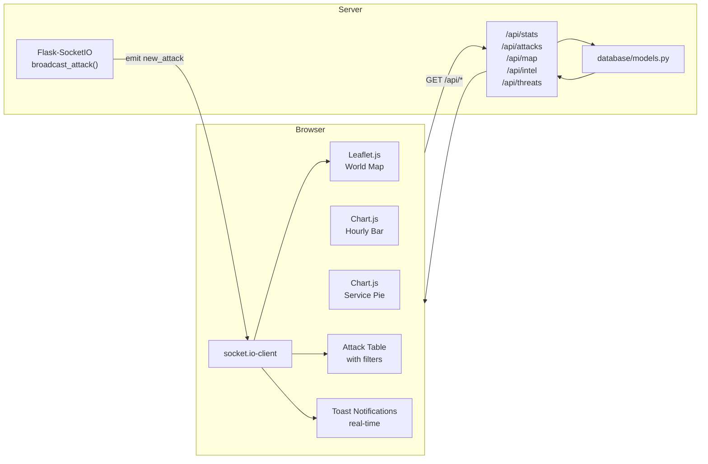

# HoneyShield — System Architecture

## 1. Overview

HoneyShield is a **multi-service honeypot platform** designed to attract, record, and analyse cyber attacks in real-time. The system consists of three main layers:

1. **Honeypot Layer** — fake services that lure attackers
2. **Data Layer** — persistent storage and geo-enrichment
3. **Presentation Layer** — real-time dashboard for analysts

---

## 2. Component Diagram

```mermaid
graph TBl
    subgraph Internet["Internet"]
        ATK1[SSH Brute-force Tool]
        ATK2[Web Scanner / Bot]
        ATK3[CVE Exploit Tool]
    end

    subgraph Server["HoneyShield Server"]
        subgraph Layer1["Honeypot Layer (Deception)"]
            SSH["ssh_honeypot.py\nparamiko fake SSH\nport 2222"]
            HTTP["http_honeypot.py\nfake Apache + WordPress\nport 8080"]
        end

        subgraph Layer2["Intelligence Layer"]
            GEO["geoip/locator.py\nIP → lat/lon/country/ISP\nip-api.com (cached)"]
            DB["database/models.py\nSQLite WAL mode\n3 tables, 6 indexes"]
            ALERT["alerts/notifier.py\nTelegram + SMTP"]
        end

        subgraph Layer3["Presentation Layer"]
            FLASK["dashboard/app.py\nFlask 3.0 + REST API"]
            WS["Flask-SocketIO\nWebSocket server"]
            TPL["Jinja2 Templates\nTailwind + Chart.js + Leaflet"]
        end

        CONFIG["config.py\n.env → os.getenv()"]
    end

    subgraph Analyst["Security Analyst"]
        BROWSER["Web Browser\nport 5000"]
        TG["Telegram App"]
        MAIL["Email Client"]
    end

    ATK1 -- TCP SYN --> SSH
    ATK2 -- HTTP GET/POST --> HTTP
    ATK3 -- TCP --> SSH & HTTP

    SSH -- raw event --> GEO
    HTTP -- raw event --> GEO
    GEO -- enriched event --> DB
    DB -- event --> ALERT
    ALERT -- bot API --> TG
    ALERT -- SMTP --> MAIL

    DB -- queries --> FLASK
    FLASK -- JSON API --> TPL
    FLASK -- emit() --> WS
    WS -- socket.io --> BROWSER
    TPL -- served HTML/JS --> BROWSER
    CONFIG -.->|settings| SSH & HTTP & FLASK & GEO & ALERT & DB
```

---

## 3. Deployment Topology



---

## 4. SSH Honeypot — Detailed Flow



---

## 5. HTTP Honeypot — Attack Classification

The HTTP honeypot classifies each request into one of these categories before storing:



---

## 6. Data Model



---

## 7. ML Anomaly Detection Pipeline



---

## 8. MITRE ATT&CK Tagging Engine



---

## 9. Intelligence Dashboard Architecture



---

## 10. Dashboard Architecture



---

## 11. Technology Stack

| Layer | Technology | Reason |
|---|---|---|
| SSH emulation | `paramiko` 3.4 | Industry-standard Python SSH library, full server-mode API |
| HTTP server | `http.server` stdlib | Zero dependencies, full control over responses |
| FTP server | raw sockets (stdlib) | Custom protocol handler, zero external dependencies |
| ML anomaly detection | `scikit-learn` IsolationForest | Unsupervised, no labelled data needed, fast inference |
| MITRE ATT&CK | Custom rule engine | 13 techniques, 6 tactics, zero API calls |
| IP reputation | Custom scoring | Multi-factor 0–100 score, campaign detection |
| Database | SQLite + WAL | Zero-config, file-based, WAL for concurrent writes |
| GeoIP | ip-api.com | Free, no API key, 45 req/min, covers all public IPs |
| Web framework | Flask 3.0 | Lightweight, well-known, easy to extend |
| Real-time | Flask-SocketIO + eventlet | WebSocket support, room-based broadcasting |
| Frontend | Tailwind CSS + Chart.js + Leaflet | Modern, CDN-hosted, no build step |
| PDF reports | `fpdf2` | Pure-Python, dark-theme branded report generation |
| Containerisation | Docker + Compose | Reproducible deploys, port remapping |

---

## 12. Performance Characteristics

- **Concurrency model**: 3 honeypot threads + main thread for dashboard (4 total)
- **SSH**: handles ~100 simultaneous TCP connections (thread-per-connection, daemon threads)
- **FTP**: thread-per-connection, same model as SSH
- **HTTP**: sequential request handling (short-lived, sufficient for honeypot loads)
- **GeoIP**: results cached in-memory for 1 hour to avoid rate limiting
- **ML scoring**: IsolationForest inference is O(log n) per event — sub-millisecond
- **SQLite WAL**: allows concurrent readers + one writer without locking dashboard queries
- **WebSocket**: broadcast uses eventlet's green threads — no blocking

---

## 13. Limitations & Future Work

| Limitation | Status | Proposed Enhancement |
|---|---|---|
| Single server | Planned | Distributed honeypot network (Kafka + ClickHouse) |
| SQLite | Planned | Migrate to PostgreSQL for high-volume deployments |
| Static SSH (no shell) | Planned | Integrate Cowrie for full interactive shell emulation |
| No PCAP capture | Planned | Scapy / libpcap full packet recording |
| Manual GeoIP | Planned | MaxMind GeoIP2 for offline, GDPR-compliant lookups |
| ML trained offline | Planned | Periodic retraining pipeline as new attacks arrive |
| Only SSH+HTTP+FTP | Planned | Add Telnet, SMTP, RDP, Modbus/ICS honeypots |
| FTP honeypot | v2.0 | Implemented — fake vsftpd 3.0.5 |
| ML anomaly detection | v2.0 | Implemented — IsolationForest, 7 features |
| MITRE ATT&CK mapping | v2.0 | Implemented — 13 techniques, 6 tactics |
| XSS detection | v2.1 | Implemented — regex classifier + T1059.007 |
| IP threat scoring | v2.0 | Implemented — 0–100 composite score |
