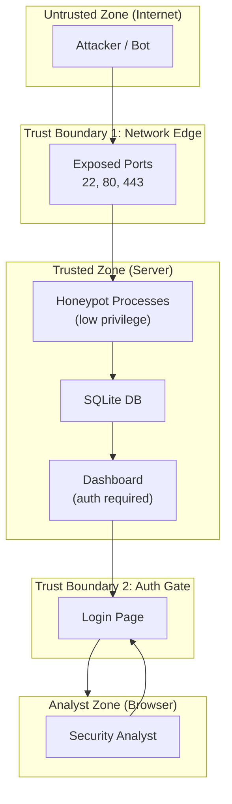
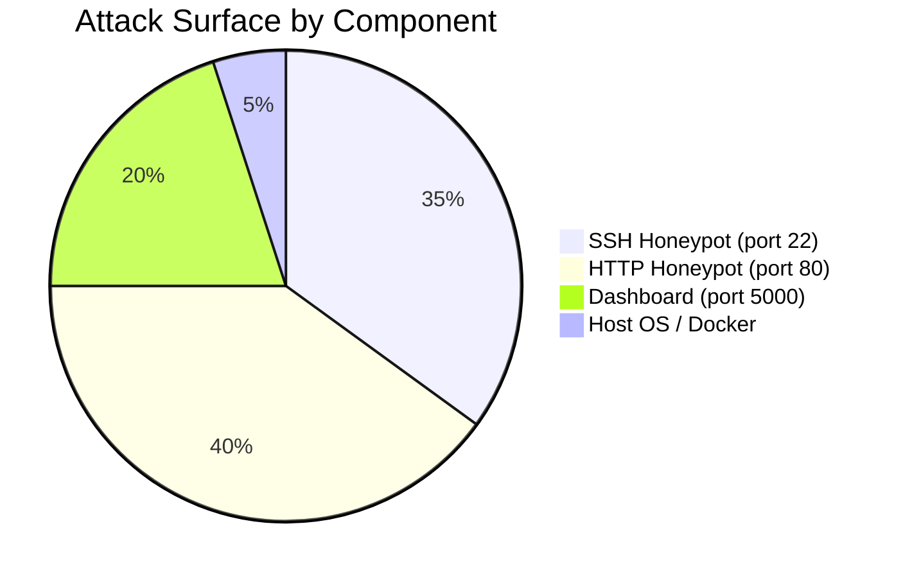

# HoneyShield — Threat Model

**Methodology:** STRIDE (Microsoft)  
**Scope:** HoneyShield server exposed to the public internet  
**Date:** 2026

---

## 1. System Assets

| Asset | Description | Sensitivity |
|---|---|---|
| `honeypot.db` | All collected attack data | High |
| `server.key` | SSH RSA host key | Medium |
| Dashboard | Attack analytics interface | Medium |
| `.env` | Credentials & API tokens | High |
| Attacker IP logs | May contain PII (IPs) | Medium |

---

## 2. Trust Boundaries



---

## 3. STRIDE Threat Analysis

### 3.1 Spoofing

| # | Threat | Component | Mitigation |
|---|---|---|---|
| S1 | Attacker spoofs source IP (amplification attack) | SSH/HTTP honeypot | Log all IPs; GeoIP lookups still work; does not affect correctness |
| S2 | Attacker impersonates the dashboard | Dashboard | HTTPS + TLS certificate (deploy behind nginx with Let's Encrypt) |

### 3.2 Tampering

| # | Threat | Component | Mitigation |
|---|---|---|---|
| T1 | Attacker tries to inject malicious data into DB via honeypot payload | `insert_attack()` | All values stored as strings; no SQL interpolation (parameterised queries) |
| T2 | Log file tampering if server is compromised | `honeypot.log` | Use append-only log rotation; send logs to remote syslog |

### 3.3 Repudiation

| # | Threat | Component | Mitigation |
|---|---|---|---|
| R1 | No audit log of dashboard access | Dashboard | Add access logging middleware |
| R2 | Attacker denies activity | DB | Timestamps + IP stored; immutable SQLite records |

### 3.4 Information Disclosure

| # | Threat | Component | Mitigation |
|---|---|---|---|
| I1 | `.env` file exposed via web server | HTTP honeypot | `.env` in `.gitignore`; never committed to repo |
| I2 | SQLite DB accessible if server is compromised | File system | DB stored outside web root; file permissions 600 |
| I3 | Dashboard leaks collected data to unauthenticated users | Dashboard | Login required on all routes; session with strong secret key |
| I4 | IP address data (PII in some jurisdictions) | Database | Document retention policy; anonymise IPs after 90 days |

### 3.5 Denial of Service

| # | Threat | Component | Mitigation |
|---|---|---|---|
| D1 | Attacker floods SSH port with connections | SSH honeypot | Thread pool with daemon threads; OS-level TCP backlog (128) |
| D2 | Disk exhaustion from log/DB growth | File system | Log rotation (logrotate); DB archival cron job |
| D3 | GeoIP API rate limiting (45 req/min) | `geoip/locator.py` | In-memory cache with 1-hour TTL |
| D4 | Memory exhaustion from too many threads | SSH honeypot | Consider asyncio-based refactor for >1000 simultaneous connections |

### 3.6 Elevation of Privilege

| # | Threat | Component | Mitigation |
|---|---|---|---|
| E1 | Attacker exploits paramiko bug to get shell | SSH honeypot | paramiko always returns AUTH_FAILED; no shell actually spawned |
| E2 | Attacker exploits Flask/Jinja2 vulnerability | Dashboard | SSTI prevented by autoescaping; keep dependencies updated |
| E3 | Container breakout | Docker | Run container as non-root user (`USER appuser` in Dockerfile) |

---

## 4. Attack Surface Summary



---

## 5. Risk Matrix

```mermaid
quadrantChart
    title Risk Matrix (Likelihood vs Impact)
    x-axis Low Likelihood --> High Likelihood
    y-axis Low Impact --> High Impact
    quadrant-1 Monitor
    quadrant-2 Critical
    quadrant-3 Accept
    quadrant-4 Mitigate
    SSH Flood (D1): [0.8, 0.3]
    DB Exhaustion (D2): [0.4, 0.6]
    Data Leak via Misconfiguration (I3): [0.3, 0.8]
    SSH Auth Bypass (E1): [0.1, 0.9]
    IP Spoofing (S1): [0.6, 0.2]
    Dependency CVE (E2): [0.5, 0.7]
```

---

## 6. Recommended Mitigations (Priority Order)

1. **Deploy behind nginx reverse proxy** with TLS (Let's Encrypt) for the dashboard
2. **Run as non-root** — use `USER 1001` in Dockerfile; bind ports via Docker `ports:` mapping
3. **Rotate logs** — configure `logrotate` for `honeypot.log` and archive DB quarterly
4. **Update dependencies** — run `pip list --outdated` regularly; pin versions in `requirements.txt`
5. **Strong secret key** — generate with `python -c "import secrets; print(secrets.token_hex(32))"`
6. **Fail2Ban** on the dashboard port to prevent brute-force of the admin login
7. **IP anonymisation** — mask last octet of stored IPs for GDPR compliance (optional)

---

## 7. Legal & Ethical Considerations

| Topic | Statement |
|---|---|
| **Legal** | Honeypots are legal in most jurisdictions when deployed on infrastructure you own. Consult local laws. |
| **Entrapment** | HoneyShield does not lure or entice users — it passively listens on open ports |
| **Data retention** | Attacker IPs may constitute personal data under GDPR — implement a retention policy |
| **Disclosure** | If a novel attack vector is discovered, follow responsible disclosure guidelines |
